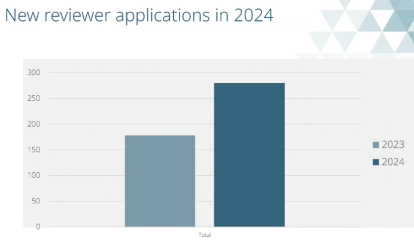
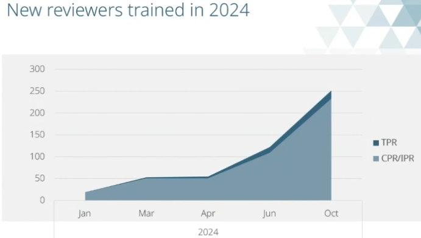

# ICE Annual reviewer conference 2025  

21/03/2025  

## Jim Hall (ICE President)  

Professional qualification is central to the ICE and a benefit to society. We need 
professionally qualified engineers more than ever. Third world development is happening
faster than it ever has. In this country we see the effects of poorly planned ageing
infrastructure, so we mustn't repeat our mistakes.   

The world needs engineers they can
trust, safety is paramount. The Hackett review has exposed a culture which led to a 
disaster. The ICE responded with "In plain sight" report. We must be unrelenting in 
pursuit of safety. Engineers should only do work for which they are qualified.  

Professional qualifications are just the start, we must keep learning.  

Engineers are key to sustainability. Electrification of heating, transport and heavy
industry. Resilience to climate change and restore nature.  

If we can't deliver on time and to budget we will not be trusted. Newspaper article
"Can we build stuff any more?" Yes we can, but productivity is an issue in the industry.
Professional qualification checks engineers can innovate, plan and monitor.  

Digitisation. In visit to HK saw digital record keeping on site fed into AI to simulate
and optimise construction. Chartered infrastructure engineer at the forefront of this
sort of development. Expecting 70 applicants in 2025.  

Reviewing capacity is a concern. 25% increase in applications last year. Doubling 
training for reviewers.  

AI in professional qualifications will be discussed today. In universities it's already
made a big difference. Universities hae pivoted to exams and interviews because 
coursework may be AI produced. AI presents opportunities but challenges. If menial 
tasks are done by AI, how to junior engineers learn?  

ICE is developing its new 5 year strategy. Really emphasising that we do everything
through our membership. By empowering member to be the best they can. Professional 
membership needs to be up to date and rigorous.  

Providing places for knowledge sharing and creating knowledge system fit for the future,
human made, not something AI could do.  

## Sean Harris (director of membership)  

Reviewers are critical for the institution. ICE is the only engineering institution to
grow year on year consistently. There is a link between qualification and competence.  
We have one of the highest levels of retention as the ICE.  

Our purpose:
To improve lives by ensuring the world has the
engineering capacity and infrastructure systems it
needs to enable our planet and our people to thrive.

How we achieve the purpose
and Plan:
What it means to be a civil and
infrastructure professional  
*Membership Division*  

Codifying, enhancing and
protecting best practice on...
What a competent profession
and industry must know  
*Engineering Knowledge Division*

What frameworks are needed to
guide effective political decisions  
*Policy Division*  

Looking for Society of Environment membership to enhance qualification.  

CPD; enhancing what members need to know about risk.  

CityZen; website apps for school age children.  

New knowledge hub.  

Our 2025 activities focus on making us:  

**Stronger**  
Increasing our
membership, and our
reach and influence,
especially in sustainable
infrastructure  

**Greener**  
Focusing on solutions that
improve environmental
performance alongside
economic development  

**More Connected**  
Fostering connections to
government, education,
employers, thought
leaders, and the public

People volunteering their time has dropped off by 30% in recent years.  

**Targets**

- Grow membership by 1%  
- AMICE campaign  
- Increase professional reviewers  
- Hong Kong Reciprocal Recognition Agreement  
- Infrastructure Engineer suite  
- Apprenticeship — the "ICE Guide"  
- ICE Connects — women in fellowship  
- Girl guiding  
- Reservoir Safety review  

**Thomas Telford Ltd**  

Is the commercial arm of the ICE.  

## Martin Pocock  

250 new reviewers in 2024.  

**Challenges** 

- Reviewer availability  
- High demand for EPAs and PRIs  

  

  

IEng EPA now a significant proportion of applications.  

  

  

  
Growth in availability from 22% from previous year.  

  
Key priority to increase EPA trained Reviewers.  

  

**Reviewer recruitment**  

Peaks in demand for reviews / EPAs  
Not all reviewers are active  
Hard to allocate EPAs  
Load not shared evenly  

  
  
  
Much smaller number number of technician members and reviewers.  

252 new reviewers trained  
254 attendees at EPA briefings  
42 reviewers received refresher training  

  
Less than 1% of reviews led to appeals.  

  
Increase in recommendation for re-audit.  

  
  

  

  

## John Laverty Q&A

AI is another technology, we're engineers, we use technology, we will adapt.  

AI ethics: are people using these tools in an inappropriate way? Equality and inclusion,
not everyone will have equal access to AI tools. Societal impact; AI can introduce bias.

We should embrace AI technology.  

The interview is our main protection from AI cheating.  

How can we use AI to help us as reviewers? Got a big database project so it's not a 
focus right now.  

Science council guidance:  
- look for unusual formatting and patterns  
- use of language, more perfect than individual in person  
- look at CV, AI CVs are generic  
- we have sponsors  
- if you have doubts, check. Don't accuse in interview, report to ICE if suspicious  

Don't say in feedback form that the candidate has cheated. Let the ICE investigate, 
pass on your suspicions.  

Appeal for AI expertise. Set up a red team. Can we hack a professional review report
i.e can we as reviewers make a good fake report with AI?  

## Neurodiversity  

Make the timings clear, this can really help neurodiverse people.  

What is neurodiversity?  
Our brains (neuro-) naturally vary from person to person (are diverse) and are a part
of human variation.
We all think, move, act, process information and communicate differently.  

15-20% of the population are neurodiverse. Don't know specifically for engineers.  

  

Try to make allowances for people who don't act normally (e.g. take a long time to 
respond).  

Each person is unique.  

Labels depend on the door you go through, and when.  

Dyslexia was a more common diagnosis historically, ADHD and autism are more common now.  

In 1950s autism was not a separate diagnosis and was part of schizophrenia.  

Two people with the same diagnosis will be very different. Someone with a diagnosis and
another without may be similar.  

3x as many males diagnosed and females, but likely to be equal in reality.  

Social and cultural biases. Shame and past experiences.  

**Not all adults are in the same boat!**
- Grown up with a diagnosis and tell some/all
- Grown up with a diagnosis and hidden from others some or
information
- Not ready to share how they feel today... working it out themself
- Think they may be neurodivergent and wanting a diagnosis
- Think they may be neurodivergent and don't want a diagnosis
- Camouflaging and compensating
- Don't recognise they are neurodivergent but others think they are!
- Also have children that are neurodivergent  

**What 'neurotypical' assumptions may you have?**
- Hesitation
- Avoidance of eye contact
- Fidgety
- Checking/rechecking the question
- Slow to respond  

**What is happening in a review situation?**
- What is new?
- What may present challenges for different people?
- What may be challenging offline?
- What may be challenging online?  

**Think about... 3 aspects -TIE**
- Tasks you are asking people to do and how you are asking
- Individual challenges and experiences they may have
- Environment they are coming into online or in person

**Individual**
- Understanding the questions — length and content and how question framed
- How long a response is appropriate
- Confidence... asking for help or clarification
- Anxiety
- Avoiding eye contact
- Fidgety (might help them focus)  

If they appear to not be paying attention, they may still be paying attention.  

**Environment if online**
- Where to look e.g., camera, down at notes, panel?
- Using unfamiliar equipment, Teams v Zoom
- Logging in
- Sharing screens /system updates
- Other distractors...(Amazon driver, cat, dogs and children)  

**Reviewers**
- Speaking too fast
- Not checking for understanding
- Not understanding the person's response
- Coming across to the other person overly direct or 'cutting in'  

**Quick tips**
- Eye contact may aid focus
- Structured questions can aid understanding
- Break questions into parts, and check for understanding
- Not everyone finds 'small talk' easy to do or 'interesting'.
- Consider the sensory environment and allow adjustments
- Focus on content.. Not hesitancy or pauses.
- Rephrase with a specific scenario (e.g., "If a project deadline is
suddenly moved up, how would you manage your workload?").  

## Rachel Skinner  

2013 sat as a judge of graduate of the year. One talked about the future of 
digital (BIM etc). Other was more traditional. Majority decided that BIM wasn't 
engineering so the traditional one won.  

In 2025 are we in a similar position on sustainability? Do we think it isn't 
civil engineering?  

If we don't recognise experts in sustainability we may lose people to other 
institutions.  

How do we spot good answers in sustainability?

How do we handle experts in sustainability?  

**Doughnut economics**  

**Whole life carbon**  
Embedded, operational, end of life.  

**Carbon positive, Carbon negative**  
They can mean the same things, poorly defined terms.  

**Equality vs equity**  
Equality = sameness  
Equity = fairness  
Do we ask enough questions of candidates about who their projects are for
who wins? who loses? and why? Engineering projects always give
opportunities to narrow the equity gap -- but only if it is a conscious thought.
New work on equitable design is now emerging e.g. gender-sensitive  

**Ask better questions around the sustainability attribute**  

Is it possible for a project to meet all 17 UN SDGs? Why or why not?  

Do we have the right data to allow truly sustainable decisions to be made?  

Can solutions be both environmentally sustainable and resilient?  

Do the three pillars of sustainability still apply?  

In 2025, is it possible to make good decisions about a project and its 
sustainable benefits/impacts in isolation?  

How well do you think [your sector] understands its impacts in terms of
sustainability?