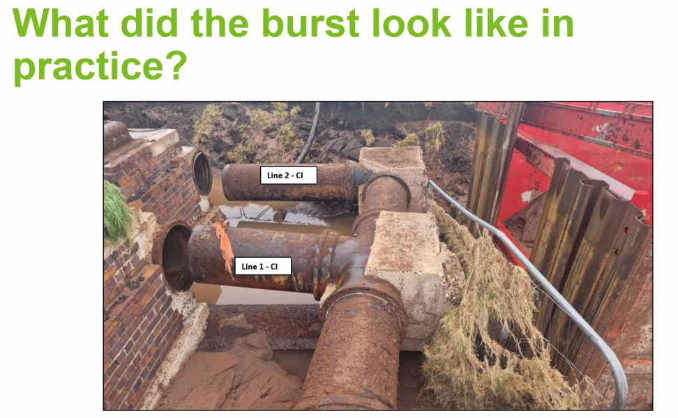

# CIRIA C816 Pipe thrusts 

*Martin Long*  

## Overview  

CIRIA Report 128 is the predecessor. New C816 updates this and blends guidance from BS ISO 21052 and BS 9295.  

Split the factors to account for passive and sliding resistance.  

The restrained joint procedure has been introduced.  

Effects from welded PE (or other) pipe has been added (thermal/Poisson's effect).  A reduction factor has been included to account for movement.  

*Karl Vaughan (Stantec Geotech Engineer)*  

• Geotechnical updates  
• Three new thrust restraint design classes allied to Eurocode 7 design categories  
• Updated soil descriptions and classifications in accordance with the latest geotechnical codes of practice  
• Contribution from fill (engineered) material including trench backfill is permitted in estimating ground resistance for thrust blocks  
• Displacement Limitation Factors (DF) IN, thrust reduction factors (Tr) OUT  
• DF for sliding resistance separated from passive soil resistance and reduced  
• Thrust block side sliding resistance contribution allowable for thrust blocks in uncemented granular soils  
• Procedure for designing for any groundwater level introduced  

## Design classes  

Class 1: Routine design  
Class 2: Specialist guidance  
Class 3: Not covered in C816  

Recommend that soil or rock identification is undertaken by trained/competent person verified by geotechnical specialist.  

Soil description/identification on site made clearer.  

Guidance on silts which can act as drained or undrained.  

You can now use the trench backfill to contribute towards thrust block resistance.  

The guide is designed to limit movement to 5 - 10mm. Report 128 had the same idea but the term "thrust reduction factor" was not thought to be self explanatory so has been replaced with "displacement limitation factor". There's been a reduction in conservatism in the factors.  

Side sliding resistance is now allowed in some circumstances (i.e. the resistance from the friction on the sides of the block). The block needs to be installed in a way that the resistance will be mobilised.  

Groundwater level may now be set at any depth, not just at ground level or below the block. Designing from first principles is slightly less conservative but more involved.  

*Martin Long*  

## Updates and additions  

- Procedure for overturning stability introduced  
- Procedure introduced to used decommissioned pipes as thrust restraint  
- Procedure introduced for connecting restrained joint systems to existing non-restrained pipelines  
- Guidance for restraining under pressure connections (valves and line stops)  
- Guidance expanded on the use of keys  
- Procedure introduced for determining minimum distance to adjacent excavations or thrust restraints  
- Guidance on structural design expanded  

RC guidance encourages the avoidance of rebar where possible.  

If doing RC design be sure to communicate factors used so as to not double up on factors.  

*Phillip Clisham (chair)*  

*Guy Cleveland (Thames Water)*  

Dealing with thrust where you have congested buried services is hard.  

Thrust blocks are often misunderstood. Contractors see them as unnecessary sometimes, hard to fit in.  

Waivers against asset standard. If thrust blocks in Thames don't conform to R128 they need a FOS against overturning of 3. A standard approach in C816 will help.  

PE contraction can give rise to large forces (example photos shown).  

Thrust restraint columns have been implemented already in Thames when abandoning trunk mains. Tried and tested method.  

The addition of a restrained length calculation is anticipated to be very beneficial.  

*Jim Tresnan (Principal Civil UU)*  

## Thrust blocks with nearby excavations  

Report 128 asked you to consider adjacent services and digging behind thrust blocks. But it gave no guidance on how to do so.  

The new C816 does cover this with Passive and active exclusion zones.  

### Incident from excavating too near a block  

An excavation was carried out for slip-lining the pipe close behind an existing thrust block. This allowed the pipes to move and an upstream socket burst. It took several weeks for the failure to occur after the excavation was opened. Initial ground disturbance probably occurred much earlier than the burst (this couldn't be verified after the incident).  

High pressure leak washes out the soil.  

  

When the incident occurred the pipes were buried to the top of the bricks, the soil got washed out.  

> Anecdote: Another burst incident was initially treated as a terrorist incident by police because the crater was so large they assumed it was a bomb.  

Small movements can lead to leaks which can wash out soil and remove support leading to a bigger problem.  

## Q&A  

*Karl* Can't reduce displacement reduction factors for pipes which can tolerate larger displacements. Would need lab testing, not well understood.  

Concrete filled abandoned pipe relies on the compressive strength of the concrete plus the friction of the pipe in the soil. Concrete will significantly reduce risk of buckling and closing gaps in the pips connections.  

*Karl* As built records should clearly record locations of thrust blocks. If you need to excavate behind a thrust block you need to put something in to deal with the force.